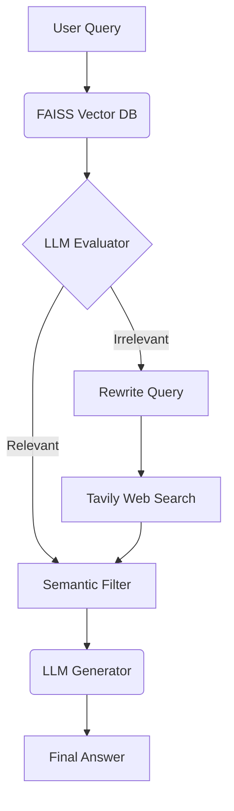

# Local Corrective RAG (CRAG) Chatbot

A high-performance, fully local Corrective Retrieval-Augmented Generation (CRAG) chatbot powered by LangGraph, LLaMA 3.1, and FastAPI.


## Features

- **100% Local LLM:** Uses Ollama and `llama3.1:8b` for generation and `nomic-embed-text` for vector embeddings. No OpenAI API costs and completely private!
- **LangGraph Agent Workflow:** Implements the Corrective RAG (CRAG) paper architecture:
  1. **Retrieve:** Pulls relevant chunks from a local FAISS vector store of PDF documents.
  2. **Evaluate:** Uses a strict LLM judge to grade retrieved chunks.
  3. **Fallback:** If local documents lack the answer, it rewrites the query and executes a web search using Tavily.
  4. **Semantic Filter:** Semantically filters huge web scraping results in milliseconds using an ephemeral vector index to prevent context bloat.
  5. **Generate:** Synthesizes the final answer.
- **FastAPI Backend:** Serves the UI and handles Server-Sent Events (SSE) for real-time streaming updates of the AI's "thought process".
- **Tailwind CSS UI:** A clean, ChatGPT-like interface featuring sidebar chat histories, smooth animations, and a collapsible "Execution Trace" panel to see the agent's internal reasoning.
- **SQLite Memory:** Persists chat history across sessions.

## Prerequisites

1. Install [Ollama](https://ollama.com/)
2. Pull the required models:
   ```bash
   ollama run llama3.1
   ollama pull nomic-embed-text
   ```
3. Get a free API key from [Tavily](https://tavily.com/) for web search fallback.

## Setup

1. **Clone the repository:**
   ```bash
   git clone https://github.com/yourusername/local-crag-chatbot.git
   cd local-crag-chatbot
   ```

2. **Set up virtual environment (optional but recommended):**
   ```bash
   python -m venv venv
   source venv/bin/activate  # On Windows: venv\Scripts\activate
   ```

3. **Install dependencies:**
   ```bash
   pip install -r requirements.txt
   ```

4. **Configure Environment Variables:**
   Rename `.env.example` to `.env` and paste your Tavily API key:
   ```env
   TAVILY_API_KEY="your_tavily_api_key_here"
   ```

5. **Add Knowledge Base Documents:**
   Drop any `.pdf` files into the root directory. The app will automatically ingest them into the FAISS index on startup.

6. **Run the App:**
   ```bash
   python -m uvicorn server:app --reload
   ```

7. **Open in Browser:**
   Navigate to [http://localhost:8000](http://localhost:8000)

## Architecture



## Future Enhancements
- Dockerize the application.
- Add support for groq/openai to allow for easy cloud deployment without local GPUs.
- Add multi-modal support (images/graphs).
