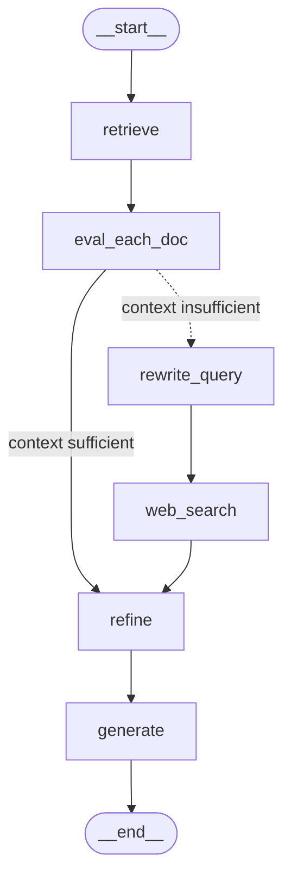

# 🧠 Local Corrective RAG (CRAG) Chatbot

A fully local **Corrective Retrieval-Augmented Generation** chatbot built with **LangGraph**, **LLaMA 3.1**, and **FastAPI**. It retrieves from your own PDFs, checks whether what it found is actually relevant, rewrites the query and falls back to web search when it isn't, refines the evidence down to the sentences that matter, and only then generates an answer, streaming every step of its reasoning to the UI in real time.

<!-- TODO: add a screenshot or GIF of the UI here -->
<!--  -->


-orange)

---

## ✨ Features

- **Corrective RAG pipeline:** a LangGraph state machine that evaluates each retrieved document and, when retrieval quality is poor, rewrites the query and falls back to web search instead of blindly generating from bad context.
- **Sentence-level refinement:** strips retrieved passages down to only the relevant sentences before generation, reducing noise and hallucination.
- **Fully local inference:** LLaMA 3.1 runs on your machine; your documents never leave it. (Only the optional Tavily web-search fallback makes external calls.)
- **Live "Execution Trace":** a collapsible panel that streams the agent's internal reasoning, node by node, over **Server-Sent Events (SSE)**.
- **Polished dark-mode UI:** dynamic radial background gradients that change on refresh, a pill-shaped glassmorphism input, smooth animations, and a collapsible sidebar with chat history.
- **Persistent conversations:** chat history stored in SQLite via SQLAlchemy, and LangGraph checkpoint state stored across sessions.

---

## 🏗️ Architecture

The agent is a LangGraph state machine. After retrieval, every document is evaluated; if local knowledge is insufficient, the query is rewritten and a web search supplies extra context. Either way, the context is refined before generation.


```mermaid
flowchart TD
    S([__start__]) --> R[retrieve]
    R --> E[eval_each_doc]
    E -- "context sufficient" --> F[refine]
    E -. "context insufficient" .-> Q[rewrite_query]
    Q --> W[web_search]
    W --> F
    F --> G[generate]
    G --> X([__end__])
```

| Node | What it does |
|------|--------------|
| `retrieve` | Pulls candidate chunks from the local PDF knowledge base |
| `eval_each_doc` | Evaluates each retrieved document for relevance to the query and routes the graph |
| `rewrite_query` | Rewrites the query into a form better suited to web search *(only on the correction path)* |
| `web_search` | Fetches external context via Tavily *(only on the correction path)* |
| `refine` | Filters the context down to the relevant sentences |
| `generate` | Synthesizes the final answer with LLaMA 3.1 |

---

## 🧰 Tech Stack

| Layer | Technology |
|-------|-----------|
| Agent orchestration | LangGraph |
| LLM | LLaMA 3.1 (local) |
| Backend | FastAPI, Server-Sent Events |
| Web search fallback | Tavily API |
| Database | SQLite + SQLAlchemy |
| Frontend | Single-page HTML, Tailwind CSS |

---

## 🚀 Getting Started

### Prerequisites

- Python 3.10+
- A local runtime serving LLaMA 3.1 <!-- e.g. Ollama: `ollama pull llama3.1` — edit to match your setup -->
- A [Tavily API key](https://tavily.com) (for the web-search fallback)

### Installation

1. **Clone the repository**
   ```bash
   git clone https://github.com/<your-username>/local-crag-chatbot.git
   cd local-crag-chatbot
   ```

2. **Create a virtual environment and install dependencies**
   ```bash
   python -m venv venv
   source venv/bin/activate        # Windows: venv\Scripts\activate
   pip install -r requirements.txt
   ```

3. **Pull the local model** <!-- edit to match your setup -->
   ```bash
   ollama pull llama3.1
   ```

4. **Configure environment variables**

   Create a `.env` file in the project root:
   ```env
   TAVILY_API_KEY="your_tavily_api_key_here"
   ```

5. **Add your knowledge base**

   Drop your `.pdf` files into the `knowledge_base/` directory. The agent (`app/core/crag.py`) loads them automatically on boot using relative paths.

6. **Run the app**
   ```bash
   uvicorn app.main:app --reload --port 8000   # edit if your entry command differs
   ```

7. **Open in your browser:** [http://localhost:8000](http://localhost:8000)

---

## 📁 Project Structure

```text
local-crag-chatbot/
├── app/
│   ├── main.py             # FastAPI server and endpoints (SSE streaming)
│   ├── database.py         # SQLAlchemy setup
│   ├── core/
│   │   └── crag.py         # LangGraph agent topology and local LLM logic
│   └── static/
│       └── index.html      # Frontend UI
├── data/
│   ├── chat_history.db     # Conversation history
│   └── conversations.sqlite# LangGraph checkpoint state
├── knowledge_base/         # Drop your PDFs here
└── .env                    # API keys (not committed)
```

---

## 🔍 How the Execution Trace Works

Each LangGraph node emits an event as it runs. The FastAPI backend forwards these to the browser over SSE, so you can watch the agent move through `retrieve`, `eval_each_doc`, the optional `rewrite_query` and `web_search` correction path, `refine`, and `generate`, instead of waiting on a black box.

---

## 📚 References

- Yan et al., [*Corrective Retrieval Augmented Generation*](https://arxiv.org/abs/2401.15884) (2024)
